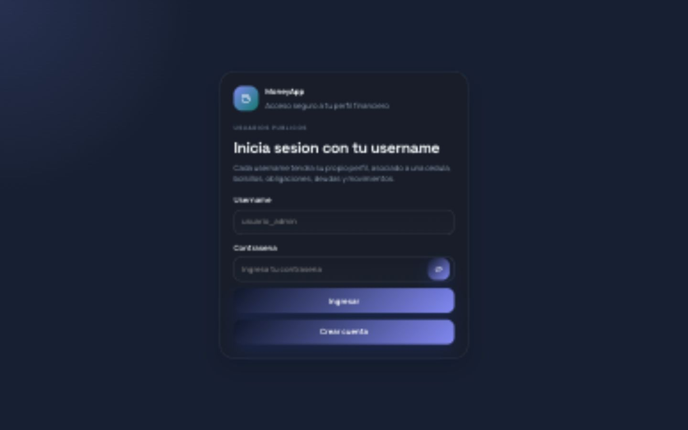
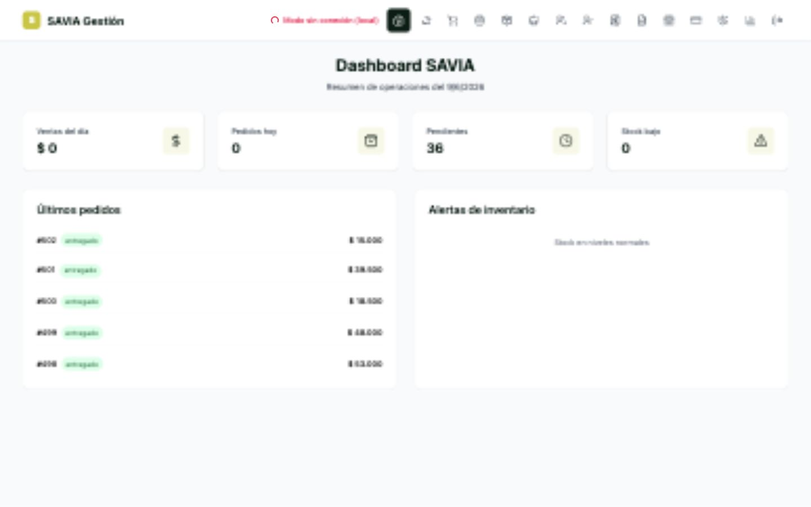
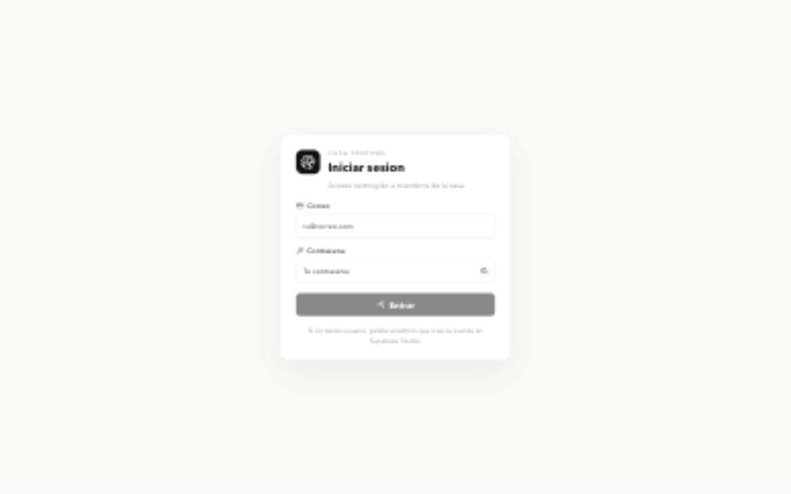
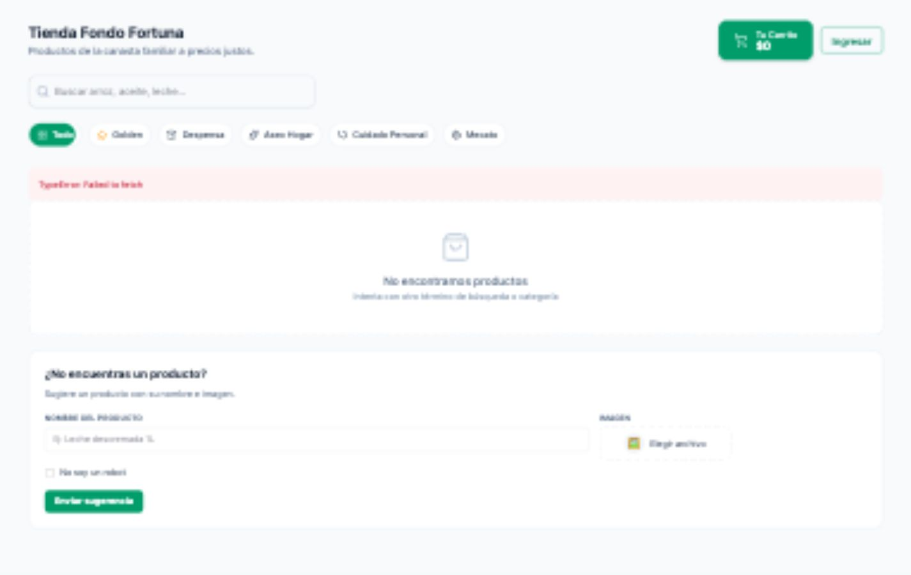
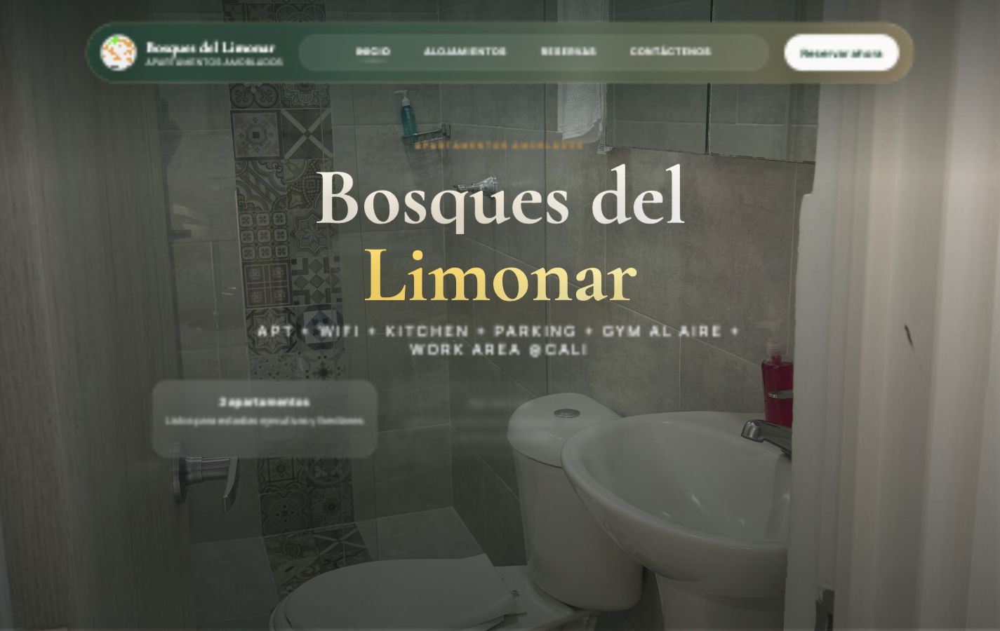
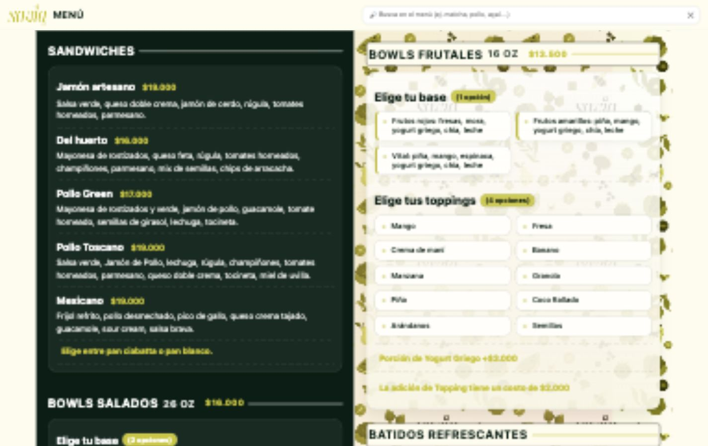
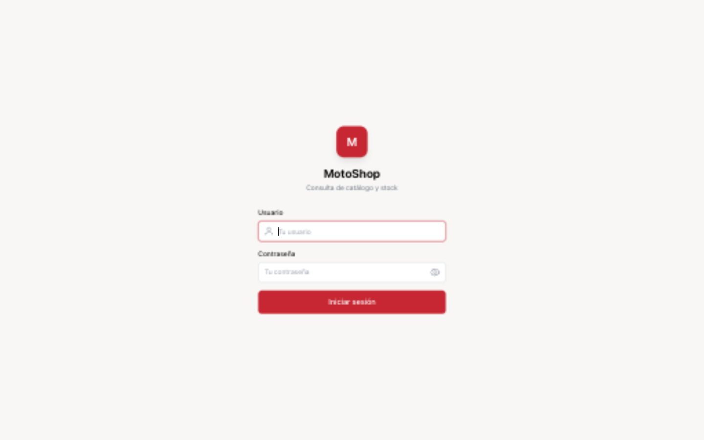
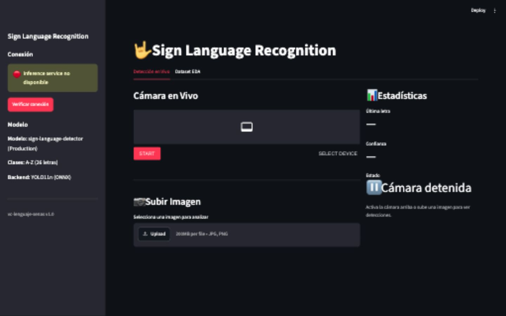
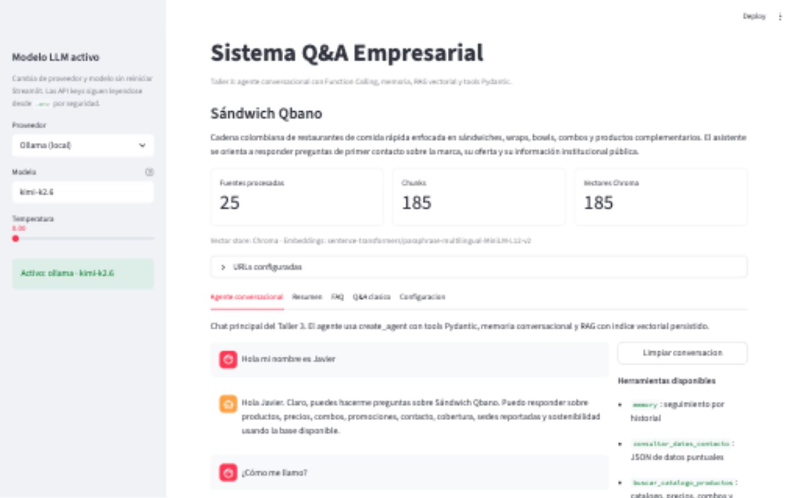

# Javier Portilla Rosero — Frontend Developer

**React · TypeScript · Tailwind CSS · Data-Rich Dashboards · Realtime UI**  
Cali, Colombia · [Portfolio](https://portafolio-javier-p.web.app/) · [GitHub](https://github.com/javierportillar) · [LinkedIn](https://www.linkedin.com/in/javier-portilla-rosero-b41342164/)

I build frontend applications for data-heavy products: dashboards, POS workflows, analytical interfaces, realtime monitoring, and media-rich admin panels. My professional background in data engineering helps me design UI around real API contracts, edge cases, loading states, performance, and business metrics — not just static mockups.

## Target role fit

| Job need | Evidence in my work |
| --- | --- |
| React + TypeScript UI | 6 React/TypeScript apps plus 3 AI/data projects across dashboards, POS, landing pages, realtime monitoring, computer vision, and LLM agents. |
| Data-rich dashboards | FinPilot, MotoShop Data, Fondo Fortuna, Casa, and Savia Inventory include KPIs, charts, filters, realtime status, and operational analytics. |
| Tailwind / modern CSS | Savia Inventory, Fondo Fortuna, and Savia Menu use Tailwind; Bosques del Limonar uses advanced responsive CSS + animation. |
| REST/API integration | Supabase, Firebase Functions, Gemini APIs, JSON-backed menu, and Raspberry Pi/Supabase command workflows. |
| Media/video handling | Casa manages camera/video workflows; Sign Language Recognition handles image/video frames through Streamlit WebRTC and gRPC inference. |
| Accessibility/performance mindset | Reduced-motion support, responsive layouts, print styles, loading/error states, and production hosting workflows. |
| English + US collaboration | English C1, remote experience with a US company, Colombia timezone with strong US Eastern overlap. |

## Featured projects

### FinPilot — Personal Finance Dashboard

**React 19 · TypeScript · Recharts · Supabase · PWA**  
[Live app](https://mymoneyappjpr.web.app/) · [Repository](https://github.com/javierportillar/personalApp)

Financial dashboard with realtime Supabase sync, charts, KPI cards, budget tracking, categorization logic, and mobile-first PWA behavior.

**Frontend highlights**
- Recharts dashboard with spending trends, category breakdowns, and financial runway views.
- Custom persistent state pattern that syncs local React state with Supabase and protects against destructive sync states.
- Reusable full-screen composer pattern for expense, income, transfer, and budget flows.
- Responsive dark UI with real loading, empty, and conflict-handling scenarios.

### Savia Inventory — POS & Operations Platform

**React 18 · TypeScript · Tailwind CSS · Supabase · Gemini API · Vitest setup**  
[Live app](https://javierportillar.github.io/saviaInventory/) · [Repository](https://github.com/javierportillar/saviaInventory)

Restaurant POS and operations dashboard with cart flows, inventory modules, split payments, kitchen/operations screens, analytics, and AI-generated strategy support.

**Frontend highlights**
- Complex cart state: customizable bowls, dynamic pricing, discounts, payment validation, and multi-method split payments.
- Tailwind-based UI across 13 modules with responsive sidebar navigation.
- Supabase-backed workflows with offline/localStorage fallback.
- Vitest + React Testing Library configured to support component and integration tests around POS and analytics flows.

### Casa — Facial Recognition Access Dashboard

**React 19 · TypeScript · Supabase · Recharts · Firebase Hosting · Raspberry Pi**  
[Live app](https://portillaroserocasa.web.app/) · [Repository](https://github.com/javierportillar/casa)

Realtime admin dashboard for a Raspberry Pi facial-recognition access system. It monitors device health, people, logs, camera previews, remote commands, and video recordings.

**Frontend highlights**
- Data-dense dashboard with 7 panels: device status, live preview, people management, logs, remote terminal, video timeline, and metrics.
- Recharts visualizations for FPS, temperature, voltage, RAM, and historical device state.
- Supabase Auth + role-aware UI for admin/member access.
- Media handling through camera previews, snapshots, training captures, and video segment playback.

### Fondo Fortuna — Cooperative Management Platform

**React 19 · TypeScript · Tailwind CSS · Framer Motion · Recharts · Firebase Functions**  
[Live app](https://fondofortuna.web.app/) · [Repository](https://github.com/javierportillar/fondof)

Management platform for an employee cooperative: savings, loans, store, role-based dashboards, WhatsApp order flow, and Gemini-powered financial advisor.

**Frontend highlights**
- React Router role-based routes for admin and user experiences.
- Recharts dashboard for savings trends and debt composition.
- Mobile drawer cart with Vaul and animated transitions with Framer Motion.
- Firebase Functions integration for secure AI advisor calls.

### Bosques del Limonar — Premium Landing Page

**React 18 · TypeScript · GSAP · ScrollTrigger · Framer Motion**  
[Live site](https://apartamentosamobladosbosquesdellimonar.com.co/) · [Repository](https://github.com/javierportillar/bosquesdellimonar)

Luxury property landing page focused on polished motion, responsive storytelling, and premium visual presentation.

**Frontend highlights**
- GSAP ScrollTrigger section reveals, card staggers, parallax hero, and slideshow transitions.
- `prefers-reduced-motion` support for accessible animation behavior.
- Responsive layout tuned for desktop, tablet, and mobile breakpoints.

### SAVIA Menu — Digital Menu & Brand Site

**React 19 · TypeScript · Tailwind CSS · Vanilla JS · JSON data**  
[Live menu](https://javierportillar.github.io/saviaMenu/) · [Repository](https://github.com/javierportillar/saviaMenu)

Digital menu and brand site for a healthy food business, combining a React landing page with a lightweight static menu optimized for fast access and printing.

**Frontend highlights**
- JSON-backed product catalog with 43 menu items across 10 categories.
- Live search filtering and responsive two-column layout.
- Print stylesheet that preserves the menu while removing navigation/search UI.

### MotoShop Data Platform — Digital Transformation Dashboard

**Next.js 14 · TypeScript · FastAPI · DuckDB · Recharts · PWA**  
[Live app](https://app.fragloesja.uk/) · [Repository](https://github.com/javierportillar/motoshopData)

Data platform for a motorcycle parts business, turning a local ERP/MySQL workflow into remote dashboards, SKU search, ETL outputs, forecasting, Telegram briefings, and AI-assisted operational insights.

**Frontend/data-product highlights**
- Next.js PWA for remote access to catalog, stock, sales, and operational KPIs.
- Recharts dashboard layer backed by FastAPI + DuckDB analytical outputs.
- Strong data-product architecture: ETL, semantic search, forecasting, API contracts, and deployment on free-tier infrastructure.

### Sign Language Recognition — Computer Vision Microservices

**Streamlit · gRPC · Docker · YOLO · ONNX Runtime · MLflow**  
Local Docker demo · [Academic repository](https://github.com/juan-plazas05/TallerFinalGestionProyectos)

Computer vision system for sign-language recognition. A Streamlit/WebRTC UI sends uploaded images or camera frames to a gRPC inference service, which runs a YOLO model exported to ONNX and returns annotated detections.

**Technical highlights**
- Microservice architecture with Docker Compose: UI service, inference service, and MLflow fallback.
- gRPC contract for streaming frame requests and detection responses.
- ONNX Runtime inference path with visible Streamlit UI for image upload and camera-based detection.

### Qbano Conversational Agent — RAG + Evaluation Workflow

**Streamlit · FastAPI · LangChain · LangGraph · Chroma · n8n**  
Local Streamlit demo · Academic project

Conversational agent built for the Técnicas de IA Aplicadas en Modelos de Lenguaje course. It includes RAG, memory, prompt experimentation, FastAPI endpoints, batch evaluation, and n8n workflow documentation.

**Technical highlights**
- Streamlit UI for provider/model selection and agent interaction.
- RAG pipeline with vector store, memory, tools, checkpointer, and batch evaluation scripts.
- FastAPI API layer and n8n documentation for workflow integration.

## Core stack

| Area | Tools |
| --- | --- |
| Frontend | React 18/19, TypeScript, JavaScript, Vite, React Router |
| Styling | Tailwind CSS, modern CSS, CSS variables, responsive layouts |
| Data UI | Recharts, KPI cards, filters, dashboards, empty/loading/error states |
| State/API | Custom hooks, Context/useReducer patterns, Supabase, Firebase, REST-style clients |
| Motion | Framer Motion, GSAP, ScrollTrigger, reduced-motion support |
| Quality | Git, ESLint, GitHub Actions, Firebase Hosting, GitHub Pages, Vitest/RTL setup |
| Data background | Python, SQL, Databricks, BigQuery, Power BI, Looker Studio |

## Professional context

My formal experience has been data-focused — data pipelines, analytical models, dashboards, and stakeholder-facing reporting — but the frontend work in these projects is intentionally aligned with product UI: complex state, realtime data, dashboards, visualizations, media, responsive design, and production deployment.

That combination is the value proposition: **frontend execution with data-product judgment**.

## Contact

- Email: [javierandres.008@hotmail.com](mailto:javierandres.008@hotmail.com)
- GitHub: [github.com/javierportillar](https://github.com/javierportillar)
- LinkedIn: [linkedin.com/in/javier-portilla-rosero-b41342164](https://www.linkedin.com/in/javier-portilla-rosero-b41342164/)
- CV: [Download PDF](assets/CVJAVIERPORTILLAROSERO.pdf)
